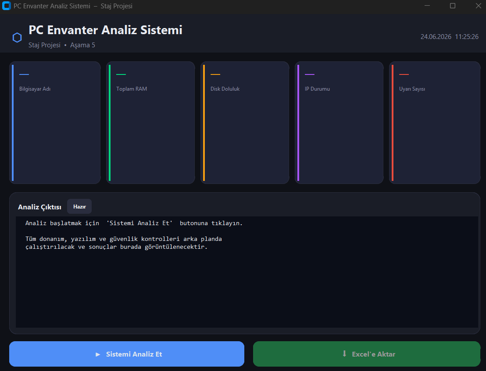

# PC Envanter Analiz Sistemi 💻📊

  

Bu proje, kurum içi bilgisayarların donanım, yazılım ve ağ özelliklerini tek bir tıkla analiz edebilen, raporlayan ve Excel formatında dışa aktarabilen modern, asenkron ve yüksek performanslı bir masaüstü otomasyon uygulamasıdır. Çayırova Belediyesi Bilgi İşlem Müdürlüğü BT altyapı operasyonlarını hızlandırmak amacıyla geliştirilmiştir.

## 🎯 Proje Amacı
Sahadaki teknisyenlerin ağdaki bilgisayarların özelliklerini manuel olarak kontrol etmesinin getirdiği zaman kaybını ve insan hatası riskini ortadan kaldırmak; cihazların donanım (RAM, detaylı CPU, Disk) yükseltme ihtiyaçlarını, eksik sürücüleri (Driver) ve kritik yazılımların varlığını otonom olarak saniyeler içinde tespit edip raporlamaktır.

## ✨ Öne Çıkan Özellikler ve Mimari
* **Asenkron Multithreading Mimarisi:** `concurrent.futures.ThreadPoolExecutor` kullanılarak 16 farklı iş parçacığı (thread) aynı anda çalıştırılır. Ağ ve lisans sorguları arka planda paralel işlenirken arayüzde (GUI) donma veya kilitlenme yaşanmaz.
* **WMI ve Thread Güvenliği (Thread-Safety):** İş parçacıklarının COM (Component Object Model) nesneleriyle etkileşimi sırasında oluşabilecek çökmeleri önlemek için özel `@with_com` Python sarmalayıcısı (decorator) geliştirilmiştir.
* **Eksik Sürücü (Driver) Tespiti:** WMI `Win32_PnPEntity` sınıfı üzerinden Aygıt Yöneticisinde "Bilinmeyen Aygıt" olarak düşen donanımları tespit eder ve Donanım Kimlikleri (Hardware ID) ile raporlar.
* **Detaylı Donanım Taraması:** Bilgisayar adı, OS sürümü, Disk doluluk oranları (PermissionError korumalı) ile birlikte; işlemcinin mimarisi (32/64-bit), fiziksel çekirdek ve mantıksal işlemci (Thread) detaylarını analiz eder.
* **Yazılım & Lisans Kontrolü:** Windows Kayıt Defteri (`winreg`) ve WMI `SoftwareLicensingProduct` sınıfları üzerinden işletim sistemi lisans durumunu ve zorunlu ofis/BT yazılımlarının kurulu olup olmadığını denetler.
* **Akıllı Uyarı Sistemi:** Olay güdümlü (event-driven) yapıda çalışan IP atama tespiti (Statik/DHCP) ve uyarı mekanizmaları bulunur. Dinamik arayüz, ekran boyutuna göre otomatik esner (Responsive) ve uzun metinleri kaydırarak (Wraplength) şık bir UX sunar.
* **Çoklu Sekmeli Excel Raporlama:** `openpyxl` kullanılarak ana envanterin yanı sıra karmaşıklığı önlemek adına "Eksik Sürücüler" verisini tamamen ayrı bir sekme (sheet) olarak `pc_rapor_{bilgisayar_adi}.xlsx` formatında dışa aktarır.

## 🛠️ Kullanılan Teknolojiler
* **Dil:** Python 3 (Nesne Yönelimli ve Modüler Tasarım)
* **Arayüz (GUI):** `customtkinter`, `tkinter`
* **Arka Uç & Sistem Sorguları:** `wmi`, `winreg`, `socket`, `platform`
* **Eşzamanlılık (Concurrency):** `concurrent.futures`, `pythoncom`
* **Veri İşleme ve Dışa Aktarım:** `openpyxl`
* **Dağıtım (Build):** `PyInstaller` (Powershell `build.ps1` betiği ile `--windowed` parametreli, siyah terminal ekranı gizlenmiş bağımsız `.exe` mimarisi)

## 🚀 Kullanım Şekli
Uygulama, sistemler üzerinde kurulum gerektirmeden taşınabilir (portable) çalışabilmesi için 20 MB boyutunda tek bir `.exe` dosyası olarak derlenmiştir.

1. Projeyi indirin veya kopyalayın.
2. `dist` klasörü içerisindeki `PC_Envanter_Analiz.exe` dosyasını çalıştırın. *(Uygulama işletim sistemi çekirdeğine WMI ve Registry sorguları yapacağından Yönetici İzinleri gerekebilir).*
3. Arayüz açıldığında **"Sistemi Analiz Et"** butonuna tıklayın. Özet kartları anında, log ekranı ise tüm asenkron thread'ler tamamlandığında formatlı olarak ekrana yansır.
4. Verileri saklamak ve sürücü detaylarını görmek için **"Excel'e Aktar"** butonuna tıklayın; uygulama bulunduğunuz dizine detaylı raporu kaydedecektir.

---
**Geliştirici:** Vedat - Düzce Üniversitesi Bilgisayar Mühendisliği
